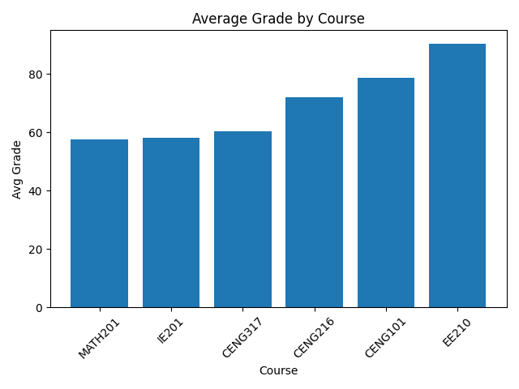
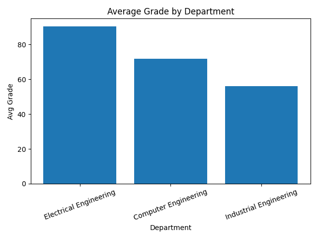

## Student Success Analysis System (SQL Server + Python)

This project is a mini end-to-end data analysis pipeline built with **SQL Server** and **Python**.

It includes database design (tables, constraints, relationships), sample student-course-grade data, analytical SQL queries, and Python-based reporting & visualization.

---

## Tech Stack
- SQL Server / SSMS
- Python 3
- pyodbc
- pandas
- matplotlib

---

## Database Schema

Tables:
- `Students`
- `Courses`
- `Enrollments`
- `Grades`

Key features:
- Primary & Foreign keys
- CHECK constraints (grade ranges, term validation)
- Computed column: `NumericGrade = Midterm*0.4 + Final*0.6`

---

## Key Analyses (SQL)
Example analyses included:
- Average grade by course
- Average grade by department
- Top students by weighted GPA (credit-based)
- Students’ improvement (Final - Midterm)
- Risky students (weighted average < 60)

---

## Python Outputs
Python script automatically:
- connects to SQL Server DB
- runs analytical SQL queries
- converts results to pandas DataFrames
- generates charts

Generated charts:
- `course_avg.png`
- `dept_avg.png`

---

## How to Run

### 1) Install dependencies
```bash
pip install pyodbc pandas matplotlib
``` 

### 2) Run analysis
```bash
python -u src/analysis.py
```

## Sample Visualizations

### Average Grade by Course


### Average Grade by Department

